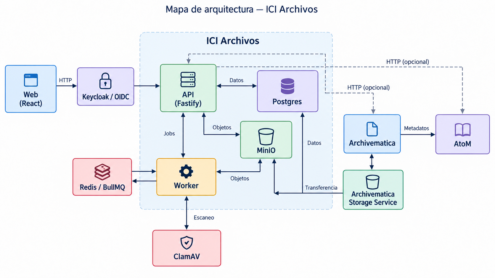
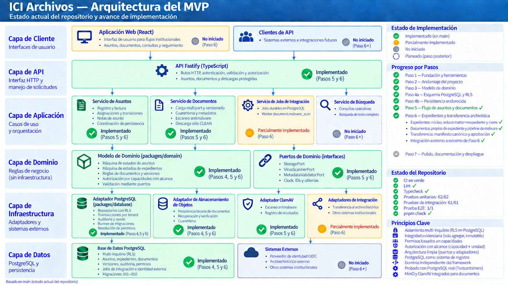

# ICI Archivos

Government records workflow coordinating operational records, AtoM archival
description/access, and Archivematica digital preservation.

## Architecture



## Status

**Step 6 — Expedientes and archival transfer boundary: complete and frozen.**

The implemented path covers matter registration, assignment and workflow;
expediente creation, linkage and closure; expediente-owned and matter-owned
documents; quarantine, durable malware scanning, CLEAN promotion and protected
download; and immutable transfer manifests through approval. Approval persists
the durable preservation intent; external AtoM/Archivematica execution remains a
future adapter boundary. The local development stack includes PostgreSQL, MinIO
and private-network ClamAV with the worker and migration jobs running in Docker
Compose.

The audit findings tranche AH-1 through AH-6 is complete and frozen. The
authoritative reconciliation is recorded in
[`docs/audit/AH-6-final-audit.md`](docs/audit/AH-6-final-audit.md).

Next: continue the main roadmap with the separately scoped external integration
adapters and deployment hardening.



## Prerequisites

- Node.js 22.12 or newer
- pnpm 11.1.3
- Docker Engine with Docker Compose for local dependencies

Development is supported on WSL2/Linux. Native Windows shells are not a supported
development environment.

## First run

```bash
pnpm install
cp infra/compose/.env.example infra/compose/.env
pnpm infra:up
pnpm dev
```

Open <http://127.0.0.1:5174>. The web application requests `/api/health`, which
Vite proxies to the API at <http://127.0.0.1:3000/health>.

## Verification

```bash
pnpm lint
pnpm typecheck
pnpm test
pnpm test:integration
pnpm build
pnpm exec playwright install chromium
pnpm test:e2e
```

`pnpm check` runs lint, typecheck, unit tests, and builds. Integration tests need
a running Docker daemon but do not use the local Compose database.

The Compose stack also runs the pinned database migration job, a worker, a
pinned ClamAV daemon on the private Compose network, and an idempotent MinIO
bootstrap job. The bootstrap creates the private
`S3_QUARANTINE_BUCKET`/`S3_CLEAN_BUCKET` buckets and a restricted application
user; it never publishes clamd's TCP port. `pnpm dev` starts only the host API
and web processes; it loads `infra/compose/.env` so the API can use MinIO at
`http://127.0.0.1:9000`. The malware worker remains in Compose, where
`CLAMAV_HOST=clamav` and `S3_ENDPOINT=http://minio:9000` are reachable.

## Workspace

```text
apps/
  api/       Fastify HTTP adapter
  web/       React operational interface
  worker/    BullMQ integration worker
packages/
  config/    Environment parsing
  contracts/ Runtime TypeBox HTTP contracts
  database/  Kysely/PostgreSQL boundary
  domain/    Framework-independent domain types
  integrations/
infra/
  compose/   ICI local dependencies
  spikes/    External-system feasibility harnesses
docs/
```

The AtoM–Archivematica feasibility harness has its own instructions in
`infra/spikes/archival-integration/README.md` and is deliberately not started by
the normal ICI development environment.

## Assignment authorization decisions

For operational authorization, the effective unit is the latest
`matter_assignments.unit_id` once a matter has been assigned. Before the first
assignment, `matters.destination_unit_id` remains the relevant unit. Matter
reads, inbox visibility, and subsequent workflow authorization should converge
on this rule.

Named assignment targets are required to be active users in the same institution
with an active, explicit `user_role_assignments` row for exactly the selected
unit at the authoritative assignment timestamp. An institution-wide role,
previous matter assignment, email address, or unit hierarchy does not establish
membership. This is the frozen pre-Step-6 decision and applies to both initial
assignment and reassignment.
